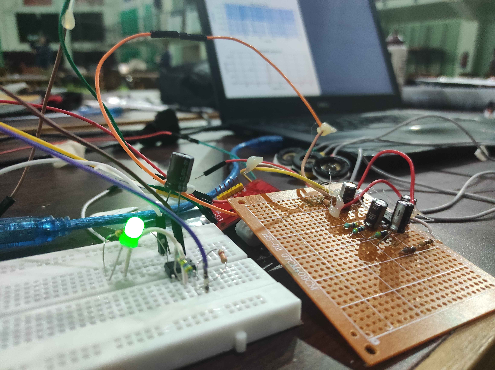
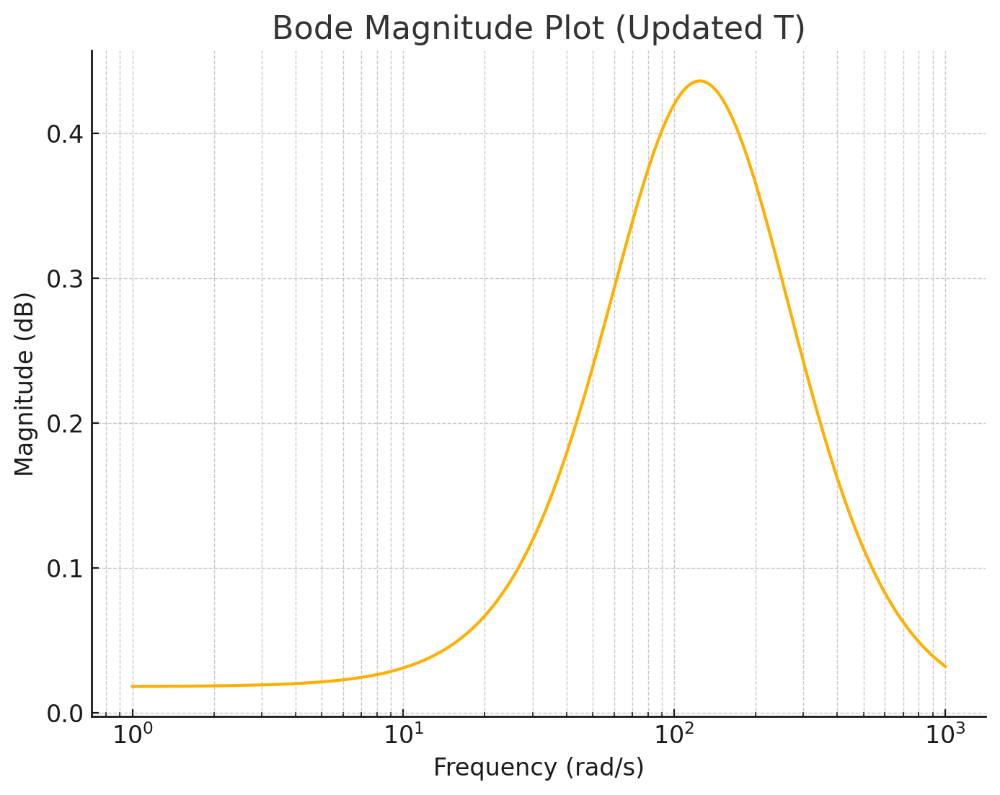

# 0x539-BCI

A Brain-Computer Interface (BCI) project designed for innovative applications in neural signal processing. This project leverages **ECG electrodes** to capture bioelectric signals and **Matplotlib** for real-time visualization of serial data. Built with a focus on simplicity and efficiency, it is ideal for exploring BCI applications.

---

## 🌟 Features
- **Real-time Signal Visualization:** Dynamically plot data using PyQtGraph.  
- **ECG Signal Processing:** Capture and analyze bioelectric signals with ease.  
- **Arduino Integration:** Seamless communication with microcontrollers using the Arduino IDE.  
- **Python Script:** A beginner-friendly, lightweight Python script suitable for signal processing.

---

## 🛠️ Installation
1. **Clone the repository:**
   ```bash
   git clone https://github.com/pratiksharma0110/0x539-BCI-.git
   cd 0x539-BCI-
   ```
2. **Install Python dependencies:**
   ```bash
   pip install pyqtgraph pyserial
   ```
3. **Set up the Arduino:**
   - Upload the Arduino sketch (`arduino/`) to your microcontroller using the Arduino IDE.
4. **Connect the ECG electrodes:**
   - Follow standard guidelines for safe and secure placement.

---

## 🚀 Usage
1. Connect your hardware and ensure all electrodes are in place.  
2. Run the Python visualization script:
   ```bash
   python serial_interface/signal_processor.py
   ```
3. Observe the real-time plotting of the captured signals.

---

## 🖼️ Visuals

### Hardware Setup


### Bode Plot


---

## 💡 Future Enhancements
- Advanced signal filtering for noise reduction.  
- Feature extraction for EEG/ECG pattern analysis.  
- Machine learning integration for BCI applications.

---
